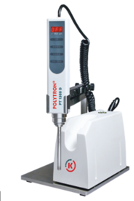
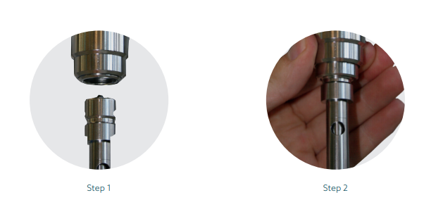
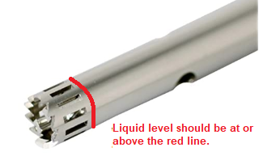

# 2.2\_homogenization\_polytron\_v1.0

| **GeneLab SOP for Tissue homogenization using Polytron Rotor Stator Homogenizer** | Document No.: | GL-SOP-2.2 |
| --------------------------------------------------------------------------------- | ------------- | ---------- |
| Version:                                                                          | 1.0           |            |
| Created:                                                                          | 01\_08\_2019  |            |
| Last revised:                                                                     | 05\_05\_2020  |            |
| Last revised by:                                                                  | Valery Boyko  |            |

**Purpose/Scope:**

The procedure below describes the steps required to homogenize biological sample using the hand held rotor stator homogenizer Polytron. This type of homogenator allow for a larger lysis buffer volume and is used mainly for samples that require larger yield and/or not yet optimized for bead homogenization. This procedure is currently routinely used for mouse skin RNA extraction that requires a downstream Trizol extraction (SOP#3.2).

**Equipment and consumables:**

1. Eppendorf Centrifuge 5810/5180 R
2. Polytron Rotor Stator Homogenizer (Kinematica PT 1300 D)

1. Styrofoam box and dissection tools (forceps, scalpel, scissors)
2. Kimwipes (Fisher Scientific, Cat#06-666 or similar)

**Reagents:**

1. Select a lysis buffer depending on the downstream extraction protocol used:

* If following SOP #3.1, on the day of tissue cutting/extraction prepare 800-800uL of QIAGEN buffer RLT + 1% b-ME per sample
* If following SOP #3.2 on the day of tissue cutting/extraction prepare 600-800uL of TRIzol solution per sample
* If following SOP #3.3 on the day of the tissue cutting/extraction prepare 1000uL of CTAB buffer per sample

1. Freshly made 70% EtOH, using molecular grade 200 proof EtOH and RNase/DNase free water
2. RNaseZap RNase decontamination solution (Thermo Fisher Scientific, Cat#AM9780 or Cat#AM9782 or Cat#AM9784 or similar)
3. MilliQ water

**Procedure:**

1. Pre-chill a centrifuge that can fit 10mL round bottom tubes to 4°C (suggested Eppendorf Centrifuge 5810/5180 R).
2. For each sample prepare 15mL conical tubes with:
   1. 10mL clean water
   2. 10mL 70% EtOH
3. Prepare general wash solutions in 50ml conical tubes: (prepare a set for each 6 samples processed)
   1. 40mL clean water
   2. 40mL 70% EtOH

**Preparing Polytron**

1. Assemble the dispersing aggregate and connect to the drive unit.

Figure 1: After assembling the aggregate by inserting the inner part into the outer shell, lift the clamp on the homogenizer and insert the aggregate into the homogenizer receptacle.

1. Perform preliminary wash of the aggregate:
   1. Set the speed to 20K RPM.
   2. Spray RNAzap on a Kimwipe and wipe the aggregate.
   3. Submerge the aggregate into the general wash tube containing the 70% ethanol and turn the homogenizer on for 5-10 seconds.
   4. Pull the aggregate out of the solution, wipe with Kimwipe until dry. _Turn on to purge the wash solution out of the aggregate and wipe with Kimwipe again._
   5. Repeat steps 4c and 4d using the general wash tube with water.

**Tissue handling**

1. Follow SOP#1.2 for tissue cutting procedure. When completed, you should have lysis tubes with a tissue ready.

**Homogenization**

1. Segregate one homogenization tube with a tissue sample to be homogenized into small ice container. Open the tube.
2. Submerge the clean aggregate into the lysis buffer with the tissue. Make sure the lysis buffer volume is covering lower aggregate holes to avoid foaming.

Figure : Liquid level to avoid foaming

1. Only homogenize samples on wet ice to avoid sample degradation via rotor/stator homogenizer’s generated heat. Homogenize tissue in intervals of 10-15 seconds with a 10-second break in between by turning the homogenizer on and gently moving the aggregate inside the lysis solution. Most tissues will require 2-3 homogenization intervals.
2. Wash the aggregate after each sample in the individual sample 15mL wash tubes by:
   1. Spray RNAzap on a Kimwipe and wipe the aggregate.
   2. Submerge the aggregate into the individual 15mL wash tube containing the 70% ethanol and turn the homogenizer on for 5-10 seconds.
   3. Pull the aggregate out of the solution, wipe with dry Kimwipe until dry. _Turn on to purge the wash solution out of the aggregate and wipe with Kimwipe again._
   4. Repeat steps 4c and 4d using the individual 15mL wash tube with water.
3. Every 2 samples, repeat steps 9a-9d with the general wash 50mL tubes. Use a fresh 50mL tube every 6 samples.

It is extremely important to purge the aggregate from any remaining wash solutions to avoid dilution of the sample lysis buffer. Proceed to the next step with a clean and dry aggregate.

1. Repeat steps 6-10 for all the samples.
2. After all samples are homogenized, transfer the homogenized sample tubes into the centrifuge and spin for 5 min at full speed in 4°C.
3. Carefully transfer the lysate in to clean, labeled 1.5ml Eppendorf tube and proceed with SOP #3.1/3.2/3.3.

**Homogenizer cleaning**

1. Disconnect the aggregate from the drive unit and take it apart.
2. Turn the drive unit off by switching the “on/off” switch.
3. Wash the aggregate with laboratory soap and dry on a paper towel before putting into storage.
