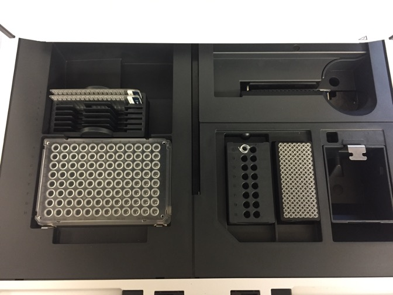

# 4.2\_genomic\_dna\_tapestation\_v1.0

| **GeneLab SOP for QC genomic DNA** | Document No.: | GL-SOP-4.2 |
| ---------------------------------- | ------------- | ---------- |
| Version:                           | 1.0           |            |
| Created:                           | 10\_04\_2018  |            |
| Last revised:                      | 05\_01\_2020  |            |
| Last revised by:                   | Valery Boyko  |            |

**Purpose/Scope:**

**GL-SOP-4.2**

GeneLab SOP for QC genomic DNA

Created: 10\_04\_2018

Last revised: 05\_01\_2020

Last revised by: Valery Boyko

This procedure describes the steps required to perform automated electrophoresis of genomic DNA to assess DNA quality using the Agilent 4200 TapeStation System and Agilent Genomic DNA TapeStation reagents. Any number of samples can be analyzed between 1 and 96.

**Equipment and consumables:**

1. Vortex mixer IKA MS3
2. 8-strip PCR tubes or 96-well fully skirted plate (Agilent, Cat#401428 or Cat#5042-8502)
3. If using a plate: Adhesive plate seals (Thermo Fisher Scientific, Cat#AB0558 or similar)
4. If using a plate: Adhesive seal applicator (Thermo Fisher Scientific, Cat#AB1391 or similar)
5. If using a tube strip: Tube caps (Agilent, Cat#401425)
6. TapeStation Loading Tips (Agilent, Cat#5067-5598 or Cat#5067-5599)
7. Microplate centrifuge (VWR, Cat#101144-214 or similar)
8. Table top vortex(VWR, Cat#102091-234 or similar)
9. Bench top microcentrifuge to accommodate 1.5mL tubes (Thermo Scientific Cat#75004081 or similar)

**Reagents:**

1. Agilent Genomic DNA ScreenTape (Agilent, Cat#5067-5365. Stored at 4C.)
2. Agilent Genomic DNA Reagents (Agilent Cat#5067-5366. Including Genomic DNA Sample Buffer and DNA ladder. Stored at 4C.)

**Procedure:**

* When using the Agilent 4200 TapeStation instrument, it is optional to include a ladder sample or use an electronic ladder setting. If sample ladder is used, it needs to be set up at the tube strip location A1 on the TapeStation deck.(See Figure 1 and Figure 2 for clarity)

1. Thaw all Agilent Genomic DNA Reagents (buffer and optional ladder) and Agilent Genomic DNA ScreenTape at room temperature for 30 min.
2. Normalize all DNA samples to 300ng/uL based on Qubit measurement (SOP#4.1).
3. Vortex Agilent Genomic DNA buffer and centrifuge.

* Do not vortex the DNA ladder

1. Setup ladder in tube/well:
   1. If using electronic ladder, TapeStation deck position strip-A1 can be used for sample analysis.
   2. If not using electronic ladder:
      1. For 1 – 15 samples: pipette 10uL Genomic DNA Sample Buffer and 1uL Genomic DNA Ladder in a top position of an 8-tube strip. Mark the ladder position as A1, it will be placed in a strip position A1 of the TapeStation deck.
      2. For 16 or more samples: pipette 20uL Genomic DNA Sample Buffer and 2uL Genomic DNA Ladder in a top position of an 8-tube strip. Mark the ladder position as A1, it will be placed in a strip position A1 of the TapeStation deck.
2. To prepare the test samples combine 10uL Genomic DNA Sample Buffer and 1uL DNA sample per tube or well.
3. Close sample plate with foil seal and tube strips with caps.
4. Place the sample plate/tube strip on IKA vortex and vortex 2000 rpm for 1 min. The speed is constant on IKA vortexer.
5. Briefly spin down using microcentrifuge to collect droplets.

**Run samples on the TapeStat**

1. Launch the Agilent 4200 TapeStation computer and the Controller Software.
2. Turn on the 4200 TapeStation by clicking on the front “on” button.
3. Open the instrument cap and set up the deck:
   1. Load the Screen Tape into the tape reader slot in the top right section. (See figure 1 and figure 2 for clarity) Each tape can accommodate 16 samples.
   2. Make sure the tape is recognized in the controller software. Once it is recognized, the type and the expiration date will be displayed on the screen.
   3. In the Controller software, click on the tube-strip and/or plate well location on screen that the samples will be placed in. This will tell the sotware where to look for samples and how many samples there will be in total.
   4. The controller software will advise you how many ScreenTapes and tips you’ll need on the deck to analyze the selected amount of samples.
   5. If running more than 15 samples, load more ScreenTapes into the ScreenTape carrier.
4. Make sure there’s enough tips in the tip box on the TapeStation deck. If more is required, open a new tip box and exchange the boxes. Alternatively, fill the existing tip box with additional tips. Make sure the tip box lid is removed before starting the run.
5. Load the samples on to the TapeStation: carefully remove caps of tube strips and/or the plate seal. Load the sample strips or 96-well plate into the instrument. If sample ladder is used in the run instead of an electronic ladder, it must be present in position A1 of the strip holders and NOT position A1 of the plate.
6. Close the instrument lid and select “start run” in the Controller software.
7. Following run, generate report using the Agilent TapeStation Analysis Software and save in Reports folder.

**Clean up TapeStation**

1. Remove sample tubes/plates, DNA ladder sample and used ScreenTape from TapeStation and dispose with accordance to safety guidelines. Unused ScreenTapes can be stored at 4C and used within 14 days.
2. Empty waste tip tray into the tip waste container.
3. Close the instrument lid and turn of the machine.

**Layout for loading the TapeStation instrument:**

.jpeg>)

Empty waste tip tray

Load enough tips

Insert tape

Place ladder in A1 position

Figure 1: TapeStation deck layout for analyzing 1-15 samples using strip tubes and sample ladder:

Insert more tapes as needed

Empty waste tip tray

Place ladder in A1 position

Load all samples on the plate

Load enough tips

Insert first tape

Figure 2: TapeStation deck layout for analyzing 16-96 samples using 96-well plate and sample ladder
