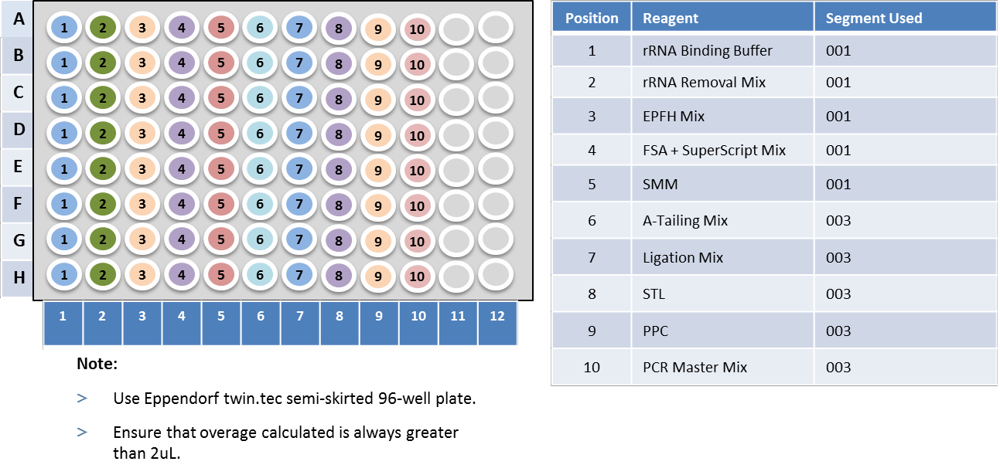
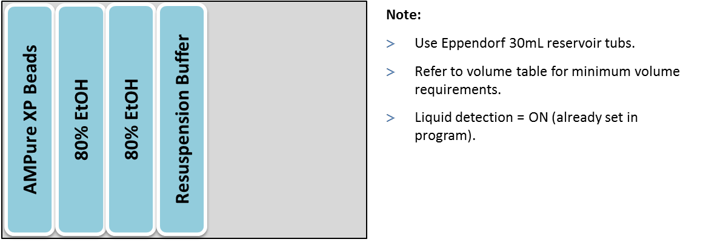
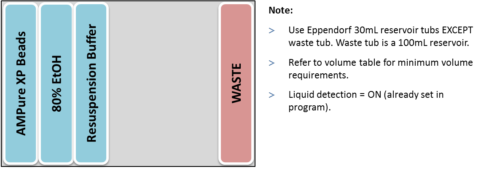

# 5.1\_truseq\_stranded\_total\_rna\_epmotion\_v1.0

| **GeneLab SOP for Illumina TruSeq Stranded Total RNA Library Prep using EpMotion** | Document No.: | GL-SOP-5.1 |
| ---------------------------------------------------------------------------------- | ------------- | ---------- |
| Version:                                                                           | 1.0           |            |
| Created:                                                                           | 10\_09\_2018  |            |
| Last revised:                                                                      | 02\_24\_2020  |            |
| Last revised by:                                                                   | Valery Boyko  |            |

**Purpose/Scope:**

This procedure describes the steps used by the NASA GeneLab to automate library preparation using the Illumina TruSeq Stranded Total RNA Gold kit on an EpMotion 5073/5075.

**Reagents:**

1. Illumina TruSeq**®** Stranded Total RNA Library Prep Gold (96 Samples) – 20020599
2. IDT xGen Dual Index UMI Adapter (384 unique indices)
3. Agencourt AMPure XP beads – A63881
4. Agencourt RNAclean up beads – A66514
5. SuperScript II Transcriptase - 18064014
6. **Eppendorf twin.tec® **_**microbiology**_** PCR Plate 96**, semi-skirted - 0030129326
7. RNA samples normalized to 1.5ug/ 18ul
8. Eppendorf 30mL reservoir tubs
9. Eppendorf 100mL reservoir tubs
10. Eppendorf reloadable 50uL tips - 0030014430
11. Eppendorf tips reloadable 300uL tips – 0030014472
12. For reagent plate (uL per well):

Table 1.

| **Reagent**                       | **32x (uL)** | **40x (uL)** | **48x (uL)** |
| --------------------------------- | ------------ | ------------ | ------------ |
| **rRNA Binding Buffer**           | **27**       | **32**       | **37**       |
| **rRNA Removal Mix**              | **27**       | **32**       | **37**       |
| **EPF Mix**                       | **41**       | **50**       | **58**       |
| **FSA + SuperScript Mix**         | **37**       | **45**       | **53**       |
| **SMM**                           | **87**       | **107**      | **127**      |
| **A-Tailing Mix**                 | **57**       | **70**       | **82**       |
| **Ligation Mix**                  | **17**       | **20**       | **22**       |
| **STL**                           | **27**       | **32**       | **37**       |
| **PPC (Don’t Vortex)**            | **35**       | **40**       | **45**       |
| **PCR Master Mix (Don’t Vortex)** | **107**      | **132**      | **157**      |

1. For reagent reservoir rack (mL per reservoir):

Table 2.

| **Reagent**                               | **32x (mL)**        | **40x (mL)**        | **48x (mL)**        |
| ----------------------------------------- | ------------------- | ------------------- | ------------------- |
| **rRNA Removal Beads**                    | **1.7**             | **2.0**             | **2.2**             |
| **RNAClean XP Beads**                     | **4.4**             | **5.2**             | **6.0**             |
| **70% EtOH**                              | **8.7**             | **10.3**            | **11.9**            |
| **Elution Buffer**                        | **1.5**             | **1.5**             | **1.5**             |
| **Resuspension Buffer (001/002/003/004)** | **1.5/2.0/3.8/2.3** | **1.5/2.0/4.5/2.6** | **1.5/2.2/5.2/2.8** |
| **AMPure XP Beads (002/003/004)**         | **3.6/4.2/2.9**     | **4.4/4.9/3.3**     | **5.1/5.7/3.7**     |
| **80% EtOH (002/004)**                    | **17.6/18.1**       | **20.8/21.3**       | **24.0/24.5**       |
| **80% EtOH (003, two reservoirs)**        | **15.1 x 2**        | **18.3 x 2**        | **21.5 x 2**        |

**General Instructions:**

The workflow is separated into five distinct segments: 001) cDNA Synthesis, 002) cDNA Cleanup, 003) Library Prep, 004) Post-PCR Cleanup, 005) Aliquot libraries for QC.

General practices and notes:

1. Whenever prompted by the software, always click “Use minimal volume”. Leave all other settings in their default mode.
2. To avoid any collision, ensure that any labware left on the desk is represented in the software.
3. During User Interventions, do **not** click “OK” until you have returned the plate to the correct position.
4. Empty waste before starting any run on EpMotion.
5. When prompted to refill tips, always use a full box of tips.
6. Record lot number of each reagents on the metadata sheet attached.
7. To avoid cross contamination, remove unused reagents and index tubes from the working area.
8. Seal the 96 well plate before each PCR steps. Roll the adhesive seal with rubber roller after application.
9. Warm up the applicable reagents to room temp as described in the protocol.
10. Do not freeze beads. Store at 4°C when not in use.
11. Use Appendix A: Metadata sheet to record samples used as well as reagent lot#.

**Procedure:**

**Segment 001: Deplete and Fragment RNA, Synthesize First and Second cDNA Strand**

1. Thaw the following reagents at room temperature for 30 min.
   1. EPH (Elute, Prime, Fragment High Mix)
   2. RRM (rRNA removal mix)
   3. RBB (rRNA binding buffer)
   4. RSB (Resuspension buffer)
   5. ELB (Elution buffer)
   6. RRB (rRNA removal beads)
   7. RNAClean XP Beads
   8. FSA (First Strand Synthesis Act D mix), contains Actinomycin D and needs to be disposed separately.
   9. SMM (Second Strand marking Master Mix)
2. Thaw SuperScript II Reverse Transcriptase at room temperature just prior to use and refreeze immediately.
3. Confirm the following RNA Denaturation program _1RNADEN_ is saved and ready to use on the thermal cycler.
   1. Pre-heat lid option is selected and set to 100°C
   2. 68°C for 5 minutes
   3. Hold at 4°C
4. Confirm the following Elution 2-Frag-Prime program _2FragPrime_ is saved and ready to use on the thermal cycler.
   1. Pre-heat lid option is selected and set to 100°C
   2. 94°C for 8 minutes
   3. Hold at 4°C
5. Confirm the following Second Strand Synthesis program _4Syn2ndStr_ is saved and ready to use on the thermal cycler.
   1. Pre-heat lid option is selected and set to 30°C
   2. 16°C for 1 hour
6. Set up sample plate with 10uL of the pre-selected, normalized RNA samples. Samples should be processed in multiples of 8 (e.g. 32, 40 or 48). Load samples from column 1 to 6. Leave sample plate on ice during preparation.
7. Add the required volume of reagents for segment 001 (Table 1) to a new 96-well plate according to the following diagram. Make FSA + SuperScript Mix on the day of experiment.

Reagent plate layout for segments 001 and 003

.png>)

1. Add the required volume of reagents (Table 2) to reservoir tubs and set up reservoir rack according to the following diagram. Make fresh 70% EtOH on the day of experiment.

.png>)

1. Turn on epMotion 5075 as well as the computer associated with it.
2. Select epBlue software on desktop, put in password and then select “Application Runner”
3. Next, select “TruSeq Stranded Total RNA” and choose “TS Total RNA 32 – 48 samples”. Select the corresponding “001” program.
4. Set up the deck according to the layout shown on screen.
5. Check to see all tools are present, lids/ covers are removed, waste bin emptied out, tips/ reagents are loaded.
6. Click “Next”.
7. Turn on HEPA filter and click “Start”.
8. Input number of samples to be processed (32, 40 or 48).
9. When epMotion alerts (insert rough timing), remove the plate from C2, seal the plate with Microseal and place on thermal cycler. Run _1RNADEN_. Each well contains 20uL of sample. Once finished, return plate to position C2 and click “OK”.
10. When epMotion alerts again (insert rough timing), remove the plate from C2, seal the plate with Microseal and place on thermal cycler. Run _2FragPrime_. Each well contains 25uL of sample. Once finished, return plate to position C2 and click “OK”.
11. When epMotion alerts the third time (insert rough timing), remove the plate from C2, seal the plate with Microseal and place on thermal cycler. Run _Syn2ndStr_ Each well contains 50uL of sample.
12. Prepare reagents needed for segment 002 while PCR program runs. Proceed to segment 002 when the program finishes.

**Segment 002: cDNA Clean-Up**

1. Thaw Resuspension buffer and AMPure XP beads at room temperature for 30 minutes.
2. Add the required volume of reagents (Table 2) to reservoir tubs and rearrange reservoir rack according to the following diagram. Make fresh 80% EtOH on the day of experiment.

.png>)

1. Open epBlue software on desktop, put in password and then select “Application Runner”
2. Next, select “TruSeq Stranded Total RNA” and choose “TS Total RNA 32 – 48 samples”. Select the corresponding “002” program.
3. Set up the deck according to the layout shown on screen.
4. Check to see all tools are present, seal/ lids/ covers are removed, waste bin emptied out, tips/ reagents are loaded.
5. Click “Next”.
6. Turn on HEPA filter and click “Start”.
7. Input number of samples to be processed (32, 40 or 48).
8. When the run finishes, remove plate from position C2. The samples are located in column 7-12.
9. Seal the plate with Microseal and store at -20°C.

**Segment 003: 3’ Adenylation, Adapter Ligation and PCR Set-up**

1. Thaw the following reagents at room temperature for 30 min.
   1. RSB (Resuspension buffer)
   2. AMPure XP beads
2. Thaw the following reagents at room temperature for 10 min.
   1. ATL (A-Tailing Mix)
   2. IDT xGen Dual Index UMI Adapter
   3. STL (Stop Ligation Buffer)
   4. PPC (PCR Primer Cocktail), invert to mix, **do not vortex**
   5. PMM (PCR Master Mix), invert to mix, **do not vortex**
3. Only take out the following reagent prior to use. Return the unused reagents to storage immediately after use.
   1. LIG (Ligation Mix)
4. Confirm the following A-Tailing program 5Atail3End is saved and ready to use on the thermal cycler.
   1. Pre-heat lid option is selected and set to 100°C
   2. 30°C for 10 minutes
   3. Hold at 4°C
5. Confirm the following DNA fragment enrich program _6LigAdapter_ is saved and ready to use on the thermal cycler **(located in the “Post-PCR” lab).**
   1. Pre-heat lid option is selected and set to 100°C
   2. 98°C for 30 seconds
   3. 15 cycles of:
      1. 98°C for 10 seconds
      2. 60°C for 30 seconds
      3. 72°C for 30 seconds
   4. 72°C for 5 minutes
   5. Hold at 4°C
6. Thaw sample plate from segment 002 on ice.
7. Add the required volume of reagents for segment 003 (Table 1) to a 96-well plate according to the following diagram. Take out LIG (Ligation Mix) just prior to use and return unused portion to storage immediately after use.

Reagent plate layout for segments 001 and 003

1. Add the required volume of reagents (Table 2) to reservoir tubs and set up reservoir rack according to the following diagram. Make fresh 80% EtOH on the day of experiment.

1. Turn on epMotion 5075 as well as the computer associated with it.
2. Select epBlue software on desktop, put in password and then select “Application Runner”
3. Next, select “TruSeq Stranded Total RNA” and choose “TS Total RNA 32 – 48 samples”. Select the corresponding “003” program.
4. Set up the deck according to the layout shown on screen.
5. Check to see all tools are present, lids/ covers are removed, waste bin emptied out, tips/ reagents are loaded.
6. Click “Next”.
7. Turn on HEPA filter and click “Start”.
8. Input number of samples to be processed (32, 40 or 48).
9. When epMotion alerts (insert rough timing), remove the plate from C2, seal the plate with Microseal and place on thermal cycler. Run _5Atail3End_. Each well contains 37.5uL of sample. Once finished, return plate to position C2 and click “OK”.
10. When segment 003 is finished, remove sample plate from position C2. Seal plate with Microseal.
11. Proceed to “Post-PCR” lab and run _6LigAdapter_ on the thermocycler. Each well contains 50uL of sample.
12. When PCR program finishes, proceed to segment 004 using epMotion 5073.

**Segment 004: Post-PCR Clean-Up**

1. Thaw Resuspension buffer and AMPure XP beads at room temperature for 30 minutes.
2. Add the required volume of reagents (Table 2) to reservoir tubs and set up reservoir rack according to the following diagram. Make fresh 80% EtOH on the day of experiment.

1. Open epBlue software on desktop, put in password and then select “Application Runner”
2. Next, select “TruSeq Stranded Total RNA” and choose “TS Total RNA 32 – 48 samples”. Select the corresponding “004” program.
3. Set up the deck according to the layout shown on screen.
4. Check to see all tools are present, seal/ lids/ covers are removed, waste bin emptied out, tips/ reagents are loaded.
5. Click “Next”.
6. Turn on HEPA filter and click “Start”.
7. Input number of samples to be processed (32, 40 or 48).
8. When the run finishes, remove plate from position C2. The final libraries are located in column 7-12. Proceed to segment 005 immediately.

**Segment 005: Aliquot libraries for QC**

Aliquot manually:

1. Remove the plate from thermocycler and label as “Final library”
2. Transfer 5uL of each library to a new 96-well plate manually using multi-channel pipette.
3. Label the sister plate as “5uL aliquot for QC (1:1 dilution)”.
4. Add 5uL DNase/ RNase – free water to each sample on the sister plate.
5. Randomly select 3 wells to measure sample volume, each well should contain 10uL.
6. Seal both plates with Microseal and store at -20°C.

Aliquot using epMotion 5073:

1. Open epBlue software on desktop, put in password and then select “Application Runner”
2. Next, select “TruSeq Stranded Total RNA” and choose “TS Total RNA 32 – 48 samples”. Select the corresponding “005” program.
3. Set up the deck according to the layout shown on screen.
4. Check to see all tools are present, seal/ lids/ covers are removed, waste bin emptied out, tips/ reagents are loaded.
5. Click “Next”.
6. Turn on HEPA filter and click “Start”.
7. Input number of samples to be processed (32, 40 or 48).
8. When the run finishes, remove plate from position C2, label the plate as “Final library”. Each well contains 25uL of library. Seal the plate with Microseal and store at -20°C.
9. Remove the plate from position C1, label the plate as “5uL aliquot for QC (1:1 dilution)”.
10. Randomly select 3 wells to measure sample volume, each well should contain 10uL.
11. Seal the plate with Microseal and store at -20°C.

Appendix:

1. Metadata sheet
2. TruSeq Stranded Total RNA Reference Guide
