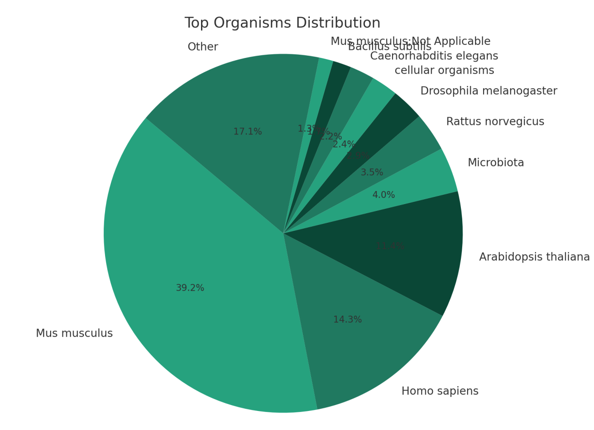

# International Standards for Space Omics Processing

<figure><figcaption>
ISSOP logo
</figcaption></figure>

[International Standards for Space Omics Processing](https://issop.astrobotany.com/)

***

####


Visit our website


#### Our Mission

The International Standards for Space Omics Processing (ISSOP) is a consortium of scientists who develop, share, and encourage sample processing standardization and metadata normalization of spaceflight “omics” experiments. We aim to optimize the conditions for scientists and the general public to derive valid hypotheses from these precious data by reducing confounding factors and increasing interoperability at the global level. Our standardization efforts are crucial for understanding the effects of spaceflight on biological organisms and preparing the international community for developing safe and effective crewed space exploration beyond low earth orbit.

#### Protocols

ISSOP aims to develop and iteratively refine protocol guidelines related to space omics sample processing. ISSOP currently hosts the latest protocols from various regions that each provide specific expertise collectively on our GitHub page:

* Link to [GitHub](https://github.com/ISSOP)



* [Members](https://issop.astrobotany.com/members/)

***

\
